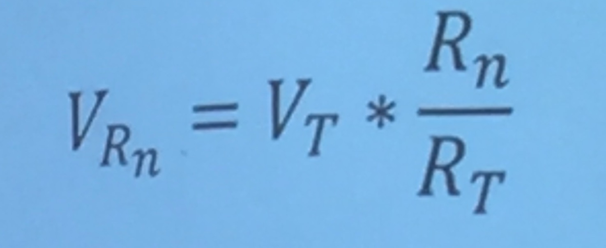
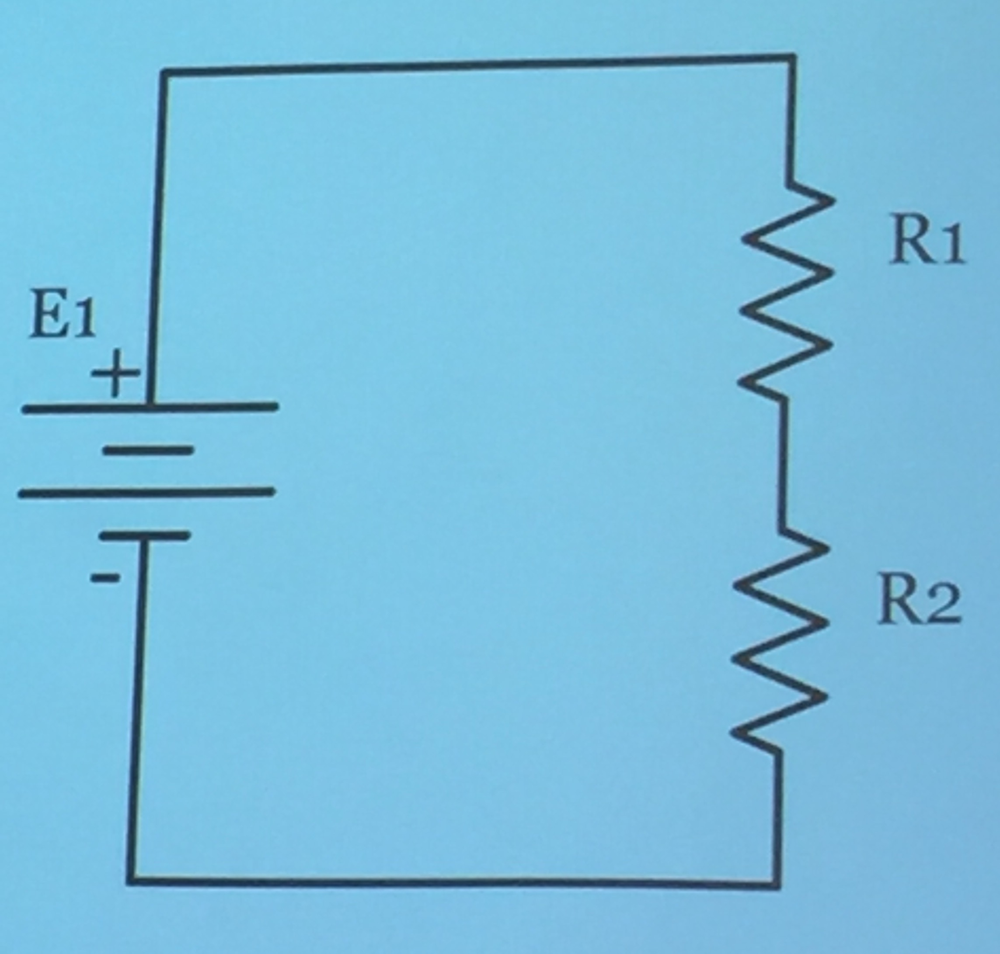
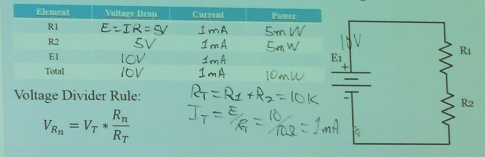
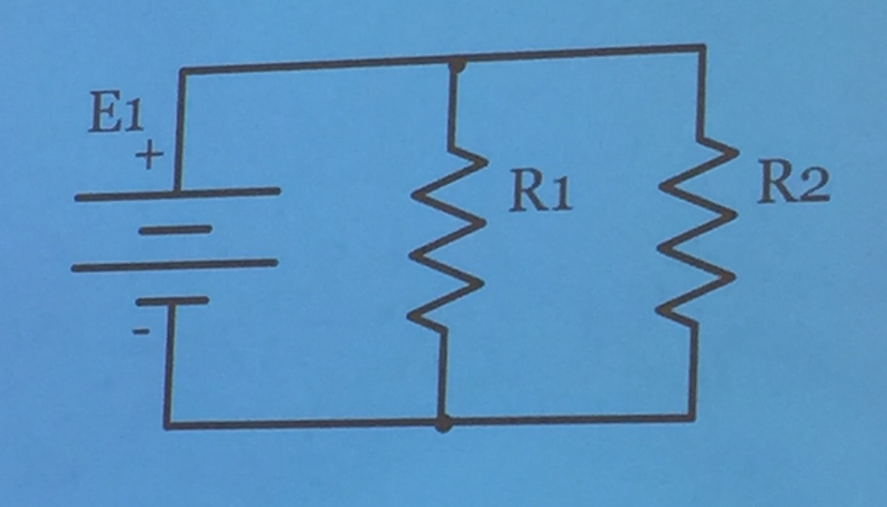
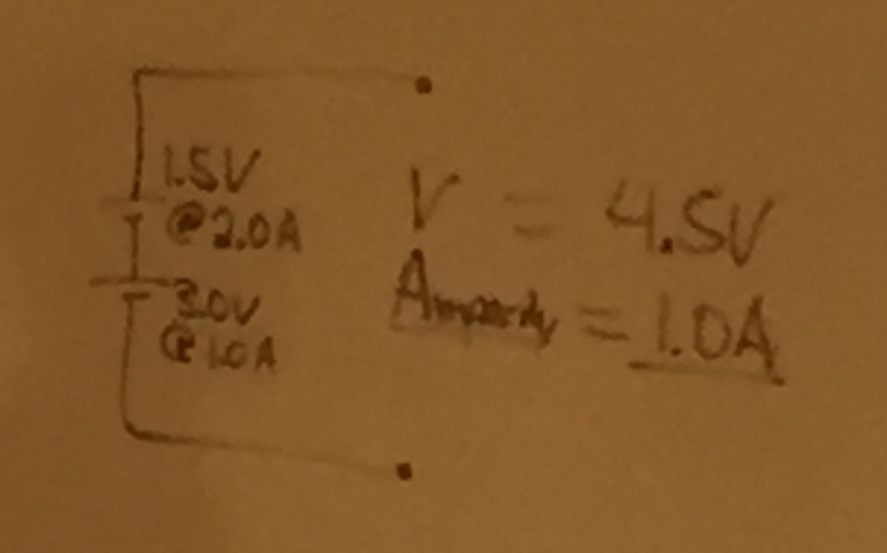
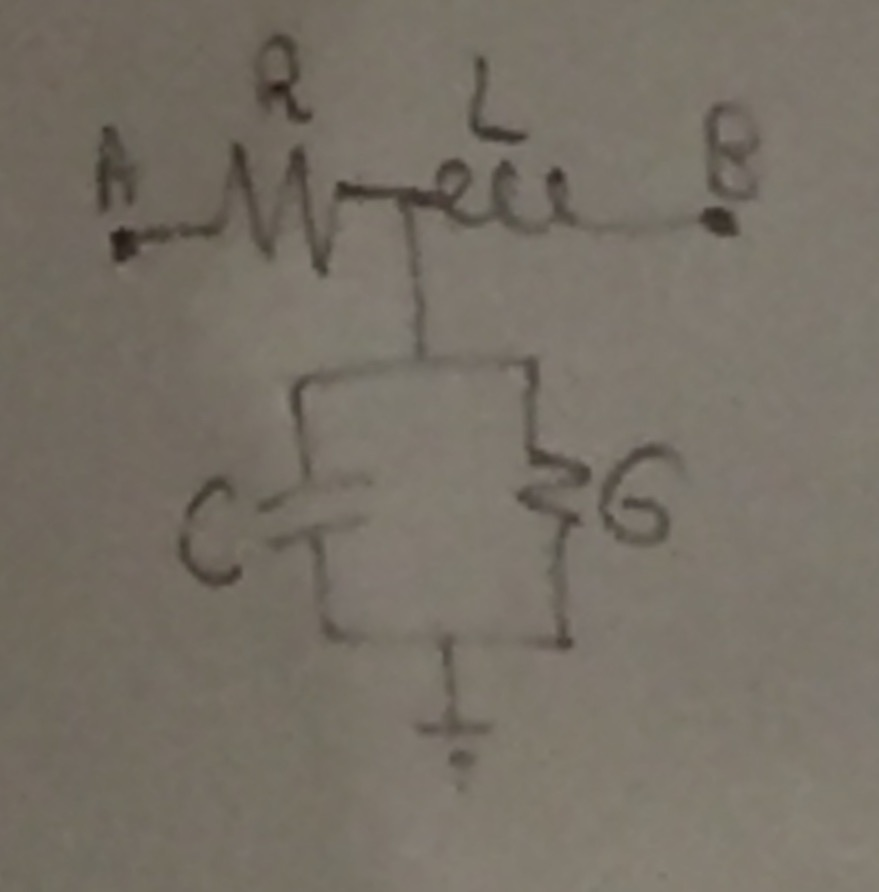
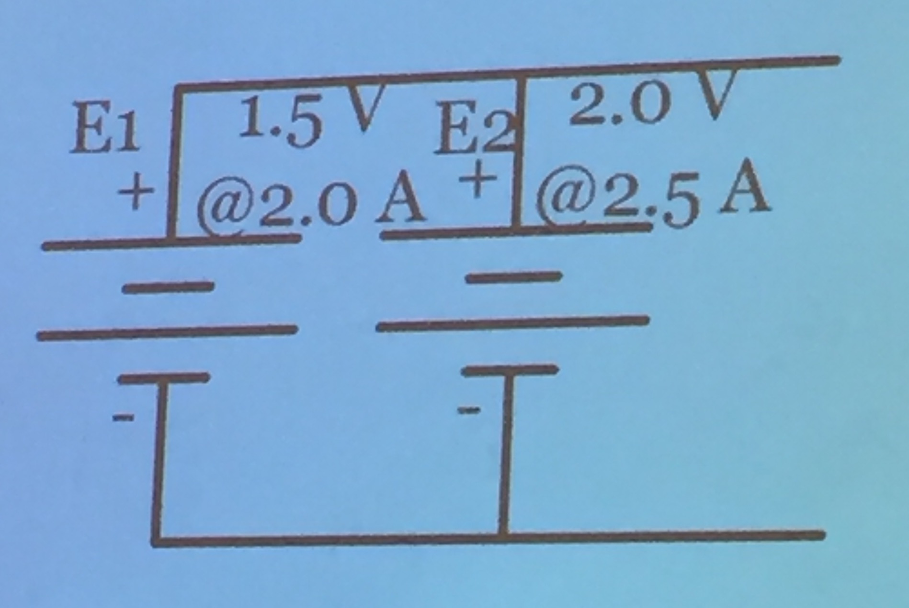

## Monday, April 26, 2016

### Upcoming Quizzes
Memorize the resistor color code, the scientific prefixes, and the electronic terms

First quiz will have 51 questions in six minutes (all memorization)  
Covers the part in green on the slides

First two quizzes in the class are closed book  
The rest of the quizzes will be open book

> See today's [lecture slides](https://camtasiarelay.byu.edu/relay/cr/Inductance_and_Inductors_-_20140910_164905_7.html) for things to memorize

### Definitions
- The flow of electrons is electricity
- `Joules` is a measure of energy
- `Watts` is a measure of rate (power/second)
- `CPS` is the old unit for `Hertz`
- `DC` is direct current (doesn't change)
- `Ampacity` (`@`) is the maximum amount of current that can be expected

### Syllabus
[Course website](http://it327.groups.et.byu.net/)

There are answers to even-numbered problems on the course website
The odd-numbered problems have their answers in the textbook

The professor didn't know of a legal way to obtain the textbook digitally

Open reading assignments:

- Read a current, technical article (not about Shakespeare)  
- Write a report on it  
- Can be turned in ASAP

Quizzes can be made up:

- For full-credit within the first week  
- For 50% credit thereafter

The professor really doesn't like not turning in assignments  
Says he will have our "attitude" grade largely decided by how many 0% assignments we have

30 points (about 20%) of our professionalism grade are awarded in response to following the Honor Code  
5 points deducted for each infraction

Most labs will take the majority of the lab time

Homework is turned in on Learning Suite

The first reading assignments are for the supplemental reading, not the textbook

### General Content
To understand digital, you have to start with analog  

Wireless, optical fiber, and copper wire are the options for getting data from point A to point B

Resistors, capacitors, and inductors are all involved in "a copper wire"

Make sure to use lowercase `f` for frequency (`F` will be used later on)

The tolerance for a resistor is the "window" of resistance  
The tigher the tolerance window, the more expensive the resistor
Nowadays, a lot of resistors are 2% resistors (we won't be tested on 2% resistors)

Any material that has a shiny surface is a good conductor
Has few electrons in the valence shell

Electrons are like a swarm on gnats  
Sticks together always  
Stays still until an electromotive force comes along (like wind with gnats)

A vacuum gives almost infinite resistance  
I assume because you need something physical for electricity to pass through

Resistance is what causes a wire to get hot while conducting electricity

It's cheaper to have more voltage through a thin wire than to thicken the wire

12 guage wiring is common for outlets  
6 guage wiring is common for stoves  
The lower the number, the thicker the wire

There is no relationship between resistance and data rate  
The inductor and the capacitor are what impact data rate

A circuit is not a circuit unless it "goes all the way 'round"

Dead skin (when dry) has a fair amount of insulation  
A tenth of an amp is enough to kill you

No battery can deliver infinite current

```
Series
All elements have the same I
RT=R1+R2+...
```
```
Parallel
All elements have the same I
RT=1/(1/R1+1/R2+...)
```

If you want more current get a thicker wire (thicker pipe for water)  
More voltage get a thicker insulation (stronger pipe for more pressure)

### Resistor Stripes
Resistors have four stripes on them:  

- Stripe 1  
- Stripe 2  
- Multiplier stripe  
- Tolerance stripe  

```
Orange, red, yellow, silver  
3,2,4,10 = 320000Ω ±10% (320kΩ)

8.2kΩ (8200Ω)
Gray, red, red, any

10.0Ω ±20%
Brown, black, black, blank
```

The standard is to never put black as the first stripe

### Fomula Variables
```
I = Current (flow)  
E = Voltage (pressure)  
R = Resistance (opposition)
```

### Ohm's Law
```
I = E/R
```

### Power Formula
```
P = IE
```

### Ohm/Power Combinations
```
P=(I^2)R  
P=(E^2)/R
```

### Voltage Divider Rule


```
5V = 10V(5kΩ/10kΩ)
```

### Kirchoff's Voltage Law
```
∑E = ∑V
```

### Electricity Sources
|Source|Current|
|---|--:|
|Solar|DC|
|Chemical (batteries)|DC|
|Generators|AC|

### Series Circuits
#### Example 1


|Element|Voltage Drop|Current|Power|
|---|--:|--:|--:|
|R1 (5kΩ)|5V|1mA|5mW|
|R2 (5kΩ)|5V|1mA|5mW|
|E1 (10V)|10V|1mA|---|
|Total|10V|1mA|10mW|



#### Example 2


|Element|Voltage Drop|Current|Power|
|---|--:|--:|--:|
|R1 (100Ω)|10V|`10V/100Ω = 100mA`|
|R2 (200Ω)|10V|`10V/200Ω = 50mA`|
|E1 (10V)|10V|`10V/(1/(1/100Ω+1/200Ω)) = 150mA`|
|Total|10V|150mA|

> Fill out the "Power" column with the power formula

### Voltage Risers


Apacity is always the lowest available ampacity  
Voltages get added

The battery that explodes when different batteries are used in series is the one with more resistance (because it heats up more)

### Parallel Circuits: Conductance
```
G = 1/R
```
Units of `G` are Siemens (`S`)


`G` is resistance in parallel on diagrams (`R` otherwise)

### Parallel Circuits: Voltage Rises

V = 1.5V = total E  
Ampacity = 4.5A = total I (ability to deliver current)

Parallel circuits act opposite of series circuits  
Currents add for ampacity in parallel
