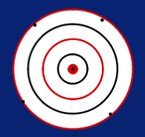

## Thursday, April 28, 2016

### Upcoming Quiz

### Definitions
- `Precision` keeps track of variation in percentage between measurements
- `Accuracy`
- `Resolution`

### General Content
Lecture about electronic measuring equipment

Anytime we measure something, we disturb what we're measuring and achieve less-than-perfect measurments (per quantum principles)  
There is no such thing as a perfect measurement

You can't have a good meter unless it's both precise and accurate

"Pixel" stands for "picture element"

### Precision
Precision is measured as a percentage  
0% precision means perfect (implying low values are good)

### Accuracy
Accuracy is also measured in percent  
Lower percentages indicate higher accuracy

  
These shots average to all bullseyes
