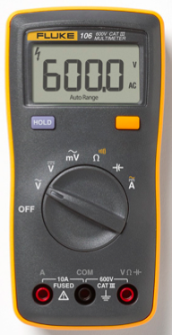
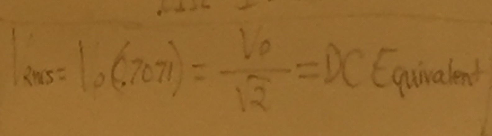

## Thursday, April 28, 2016

### Definitions
- `Precision` keeps track of variation in percentage between measurements
- `Accuracy`
- `Resolution`
- `Impedence` is basically resistance for now
- `Meter Loading Effect` is the impact using a volt meter has on measuring the current of a circuit

### General Content
Lecture about electronic measuring equipment

Anytime we measure something, we disturb what we're measuring and achieve less-than-perfect measurments (per quantum principles)  
There is no such thing as a perfect measurement

You can't have a good meter unless it's both precise and accurate

"Pixel" stands for "picture element"

There's no such thing as no resistance

The reference in a non-grounded car is the biggest piece of metal (the chassis)  
The reference point does NOT have to be the literal ground

Green screws are the national standard (NEC code) for the ground point
In a generic cable, the ground wire is not insulated because it's always safe to touch

"AC is a lot more important to us than DC"  
If we didn't have AC, we couldn't transmit information from point A to point B

There are four types of voltage:

- DC
- AC Vp-p (peak to peak)
- AC Vp (peak)
- AD Vrms (root mean squared)

In order from least to greatest:

- AD Vrms (root mean squared)
- AC Vp (peak)
- AC Vp-p (peak to peak)

The carrier will ALWAYS be a sine wave in this class  
This is because in the real world the carrier is always a sine wave

We can modulate sine waves in the domains of frequency, amplitude, and phase (phase is represented by Ф which is phi)

### Precision
Precision is measured as a percentage  
0% precision means perfect (implying low values are good)


### Accuracy
Accuracy is also measured in percent  
Lower percentages indicate higher accuracy

  
These shots average to all bullseyes

### Resolution
Measured in digits, %, ppm (parts per million)  
High value in digits = good  
Low value in % or ppm = good

  
This multimeter shows 4 digits which is a possible range of 10,000 numbers  
```
(1/10000)/(1/100) = 0.01% = 100 ppm
```  
Calculating resolution depends on the relationship between `1/100`

### Multimeters

Ground always goes in black "COM" port

Multimeters contain a voltmeter, ammeter, and a resistance meter

### Voltmeter
Voltmeters have something inside them called a internal resistor impedence  

You can accidentally short circuit a circuit with a volt meter if the meter has less impedence than the resistor it's measuring does (EG: a 10 MΩ voltmeter on a 100MΩ resistor)  

An ideal (theoretically perfect) voltmeter has an impedence of infinity  

Voltmeters NEED to be in parallel to resistors being measured  

Volt meters measure with reference to the black, ground contact

### Ammeter
Ammeters (not a misspelling) measure current  

Should be place in series  


Meters have fuses that blow on occasion  
If you measure no current at all, you probably have a blown fuse

### Ohmmeter
Ohmmeters are ammeters with an applied voltage

Measures electical resistance

"Measures the current and calls it Ohms"

### Oscilloscope
Used for measuring voltage

Mostly geared toward AC

Displays current as a waveform on a screen

Has 10 MΩ impedence like a voltmeter

### Vrms

