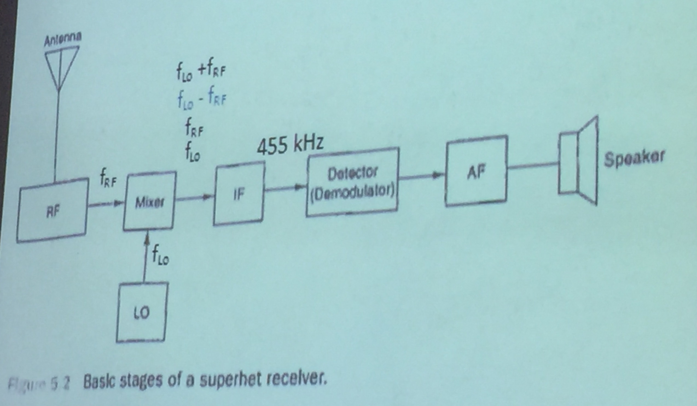
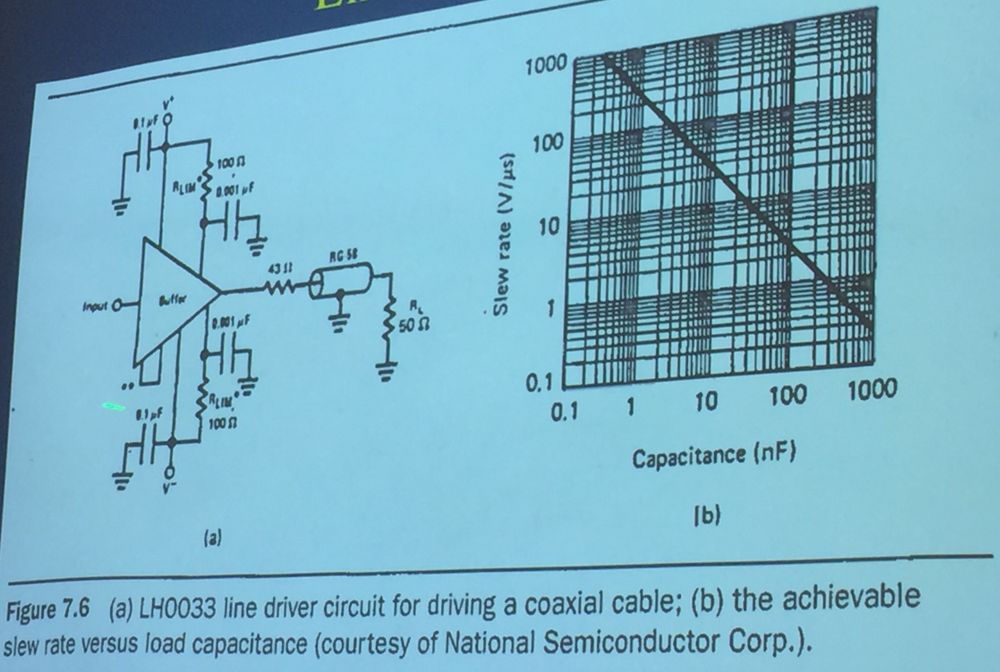

## Thursday, May 12, 2016

### Definitions
- `BER` is bit error rate (number of bits transmitted correctly)

### General Content
FM is opposite of AM

Amplitude in FM doesn't change in time-domain

FM requires much more bandwidth as shown by the large increase in sidebands as compared to AM

Commercial FM uses a modulation index of `4.0`

||Efficiency|Bandwidth|Noise|Circuit Complexity|
|---|---|---|---|---|
|AM|Poor (16%)|Narrow|More Susceptible|Simple|
|FM|Good (60%)|Wide|Less Susceptible|More Complex|

FM and AM are used about the same amount

Capacitance is the biggest culprit for slower data rates (dv/dt)

A capacitor is two conductors separated by an insulator

We have two kinds of amplifiers in this class:  

- Drivers
- Receivers

Differential signals is a form of noise cancellation

CMRR (Common mode rejection ratio)  
Commonly 90-120 DB(V)

A regenerating receiver takes "wiggly" data, cleans it up, and amplifies it

**All** systems add noise

Velocity of propagation is measured in percentage of the speed of light

For optimal data transfer, we want Zout, Z0, and Zin to be the same

Reflextions are bad for data transfer

```
Z0 = sqrt((R + j*2*pi*f*L)/(G + j*2*pi*f*C))

R and G are negligible

j*2*pi*f cancels once we remove R and G

Z0 = sqrt(L/C)
```

TDR is a time-domain reflectometer  
Used to find imperfections/cuts in cables (you can find the distance to an imperfection)

### Superheterodyne
RF = Radio Frequency amplifier  
LO = Local Oscillator  
IF = Intermediate Frequency  
AF = Audio Frequency  
Flo > Frf  
Two different signals mixed



### Potential Excellence Project
During a thunderstorm, go to an AM/FM radio, tune to where there's no station  
On AM, you'll hear a lot of interference during a lightning strike  
On FM, there's only a tiny tick  
Record this for an Excellence Project

### Slew Rate
Tells us how fast is voltage changing with respect to time

