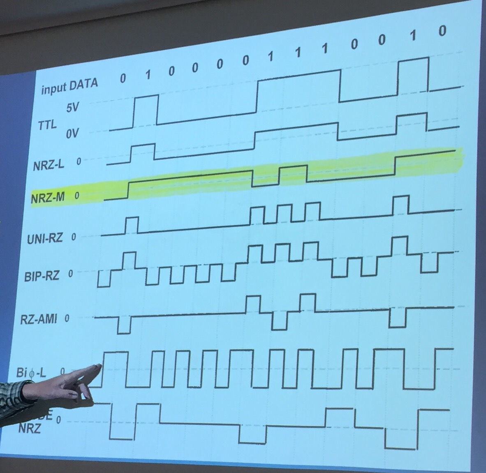
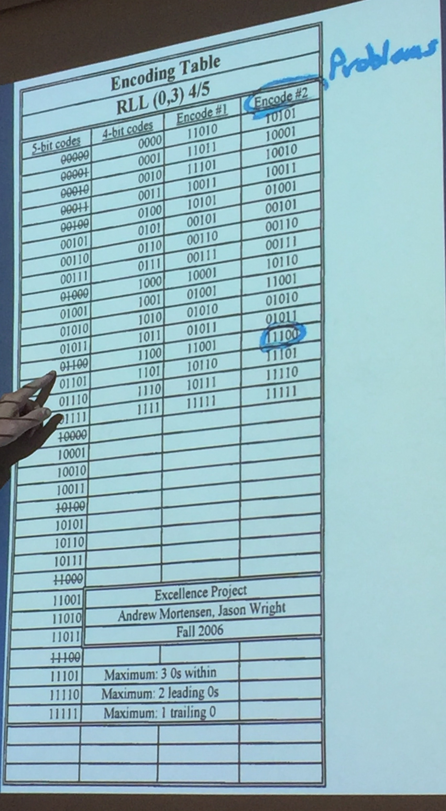
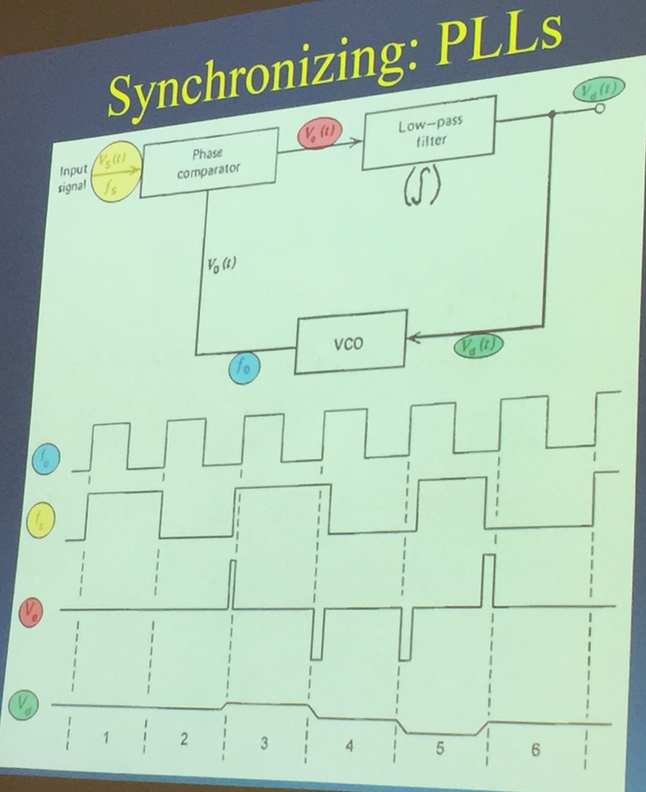

## Thursday, May 19, 2016

### Definitions
- `Antialiasing filters` (a low-pass filter) solve the problem of sampling too slowly in an ADC

### General Content
There are six blocks in **all** digital communication systems (broken into two categories):  

1. (A) Antialiasigin filter
1. (A) ADC
1. (A) Parallel-to-serial converter
1. (B) Serial-to-parallel converter
1. (B) DAC
1. (B) Antialiasing filter

Parallel-to-serial converters and Serial-to-parallel converters are the same thing but running in reverse

TTL is the encoding option we've studied the most so far  
NRZ-M is actually the most-used

ASCII is LSB (least-significant bit first)

### Possible Test Questions
Shorter = Less power?  
Longer distances have more resistance and more capacitance  
Because of more capacitance, we need more power  
More power is opposed by the resistance of the wire and the inductance of the cable

dv/dt drives di/dt

### Run Length Limited Encoding

Fixes the problem of too many zeroes in a row in the NRZ-M encoding method

Allows no more than three zeroes in a row

You can have an infinite number of ones in a row

### PLL (Phase-Locked Loop)

VCO (Voltage-Controlled Oscillator) - if voltage goes up, frequency goes up

The VCO generally knows a value that the data should be coming in (EG: 1 MHz from a known 1 Mb/s)

Error voltage (the green one in the picture) is an integral of the red signal. The error voltage regulates the speed of the clock through the VCO.

If a signal is moving away from the source (a car and a GPS for example), the clock will constantly be changing due to the doppler effect which is why the clock has to constantly update
