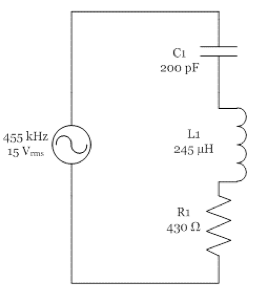

## Tuesday, May 3, 2016

### Definitions
- `Current` movement of electrons
- `Reactance` another form of opposition
- `Permability` is the degree to which a material loves magnetic fields
- `Permitance` is the degree to which a material loves voltage fields
- `Self-inductance` is always the same as `inductance`
- `Kirchhoff's voltage law (KVL)` states that the sum of all the voltages around the circuit is equal to zero
- `Parasitic inductance` is when you want resistance but get some or all inductance
- `Static electricity` is electricity that is not moving

### General Content
Don't use DC offset on the function generators in the lab (we just won't need it for this class)

To check current direction, use the right-hand rule (where thumb points in direction of current)

Coiling wire (in an inductance situation) results in a larger magnetic field

DC has a frequency of `0`

Even straight wire has inductance, coils just concentrate it

Resistance always has a phase angle of `0 degrees`  
Inductive phase angles are always `90 degrees`

All circuits (and all elements of circuits) have resistance, inductance, and conductance  
If an element has qualities we don't want, those qualities are called `parasitic` because they "come along for the ride"

You have to supply reactive power to reactive circuits, but you get it all back

Ideally, `Q` is infinite  
In reality, it's between `10` and `100`

Think of self-inductance as inertia  
Opposes `∆I`

```
L = (μo * μr * N^2 * A)/l

μo = 1.256e-6 H/m
μr = 1.0000003 (air) to 1000000 (metglas)
```

Capacitors behave as though electricity is flowing through them during the time we are charging them, but once they are fully charged, no electricity flows through them

Batteries are NOT capacitors even though they behave similarly

Current (moving electricity) is all that is needed for inductance

Two conductors separated by an insulator results in capacitance  
Capacitance in ethernet cables is one of the toughest things opposing data transfer rates (we can't really get rid of it)

```
εo = 8.85e-12 F/m
εr = 1.0006 (air) to 310 (Strontium Titanate)
```
Remove energy from a filter by allowing it to dissipate over time

Frequency selective circuits use capacitors

|Type|Opposes What?|Dissipates Power?|Causes Phase Shift?|
|---|---|---|---|
|`R`|`I`|Yes|No|
|`XL`|`∆I`|No|Yes +90 degrees|
|`XC`|`∆E`|No|Yes -90 degrees|
|`Z`|`I`, `∆I`, `∆E`|Can|Can|

```
XL
|
|
|---------R
|
|
XC
```

### RLC Circuits

Frequency selective circuits  
An RLC circuit is an electrical circuit consisting of a resistor (R), an inductor (L), and a capacitor (C), connected in series or in parallel



```
XC = 1/(2(pi)455kHz * 200pF) = 1.75 kΩ
XL = 2(pi)455khz * 245µH = 700 Ω
ZT = 430 Ω + j1.75 kΩ - j700Ω = 430 Ω + j 1.050 kΩ
VL = 13.2mA * 700Ω
VC = 13.2mA * 1.75kΩ
```

|`ZT`|`IT`|`VR`|`VL`|`VC`|
|---|---|---|---|---|
|`1.135kΩ/67.7 degrees`|`13.216 mA/67.7 degrees`|`5.68 V/67.7 degrees`|`9.24 V/157.7 degrees`|`23.1 V/-22.3 degrees`|

At a certain point, `XL`, and `XC` can be equal which completely removes reactance

### Test Questions
```
What is it about inductance that opposes changes in I?

Inductance is the property of the magnetic field associated with current
It's the magnetic field that opposes changes
```

```
Is it possible to have voltage without current?

Yes
```

```
What is it about capacitance that opposes changes in E?
```
