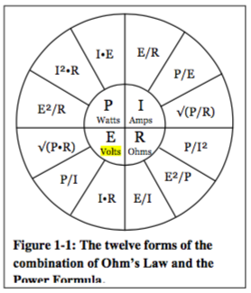

### Variables
```
I = Current (amps)
E = Voltage (volts)
R = Resistance (Ω)
```

### Ohm's Law
Give all 3 forms of the Ohm’s Law equation.
```
I = E/R
```

### Power Formula
Give 3 forms of the power equation.
```
P = IE
```

### Ohm/Power Combinations


### Resistor Calculations
```
Series
All elements have the same I
RT=R1+R2+...
```
```
Parallel
All elements have the same I
RT=1/(1/R1+1/R2+...)
```

### Vectors
```
Conversion to rectangular:

x = z*cos(theta)
y = x*sin(theta)
```

```
Conversion to polar:

Magnitude: z = sqrt(x^2 + y^2)
Angle (direction): theta = arctan(y/x)
```

### Miscellaneous
```
Inductance (inductive reactance): XL = 2(pi)fL
Capacitance (capacitive inductive reactance): XC = 1/(2(pi)fC)
```
