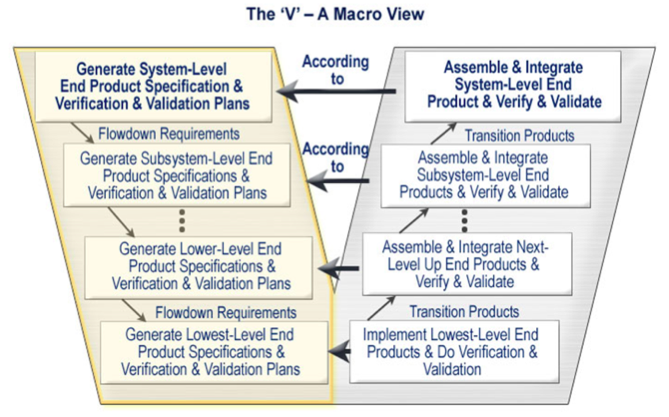

## Wednesday, August 31, 2016

### General Notes
- Attendance is 10% of our grade
- Role will be passed around every morning (put a check next to your name)
- It is easiest to mitigate risks in a project at the beginning of the project
- There's no textbook for this class, but we refer to the [Systems Engineering Body of Knowledge wiki](http://sebokwiki.org/wiki/Guide_to_the_Systems_Engineering_Body_of_Knowledge_(SEBoK)) on occasion
- Tackle the hard aspects of the project at the beginning instead of focusing on the stuff we like/know how to do

### Definitions
- **Risk** Defined in [ISO 31000](http://www.iso.org/iso/home/standards/iso31000.htm) as the effect of uncertainty on objectives, whether positive or negative
- **Risk Management** Coordinated and economical application of resources to minimize, monitor, and control the probability and/or impact of unfortunate events or to maximize the realization of opportunities
- **Lifecycle Model** A model or definition of "how things will work from beginning to end"

### Quotes
> Reports that say that something hasn't happened are always interesting to me, because as we know, there are [known knowns](https://en.wikipedia.org/wiki/There_are_known_knowns); there are things we know we know. We also know there are known unknowns; that is to say we know there are some things we do not know. But there are also unknown unknowns – the ones we don't know we don't know. And if one looks throughout the history of our country and other free countries, it is the latter category that tend to be the difficult ones.

### Iterative Models
1. **Incremental-build** Iterative implementation-verification-validations-demonstration cycles
1. **Spiral** Iterative risk-based analysis of alternative approaches and evaluation of outcomes
1. **Agile** Iterative evolution of requirements and code on top of a platform environment (can't work without a stable, existing infrastructure)

### Vee Model

