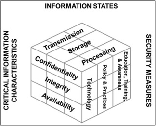

## Monday, September 12, 2016

- `Non-Repudiation` Nobody can do something and say they didn't do it because you can prove that they did (authentication + integrity = non-repudiation)
- `Least Privilege` Minimum amount of privilege you need to do your job

### General Notes
- Two-factor authentication involves a few things:

1. Something you know
1. Something you are
1. Something you have
1. Where you are
1. What time it is

### Steps of Access Control (AAA)

1. Indentification
1. Authentication
1. Authorization
1. Accountability (logging)

### McCumber Cube

